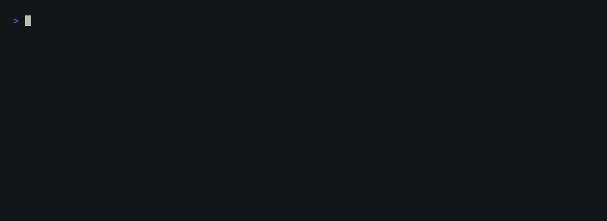
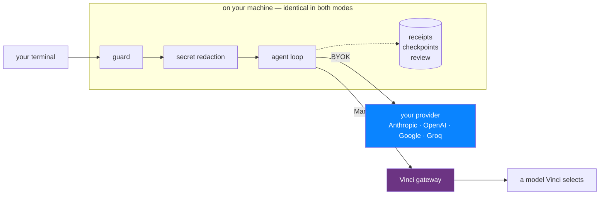

<div align="center">

<picture>
  <source media="(prefers-color-scheme: dark)" srcset="vinci/assets/logomark-inverse.svg" />
  
</picture>

# Vinci Code CLI

A terminal coding agent you can run with **your own provider key** — or with Vinci's managed
service.<br/>Same guard rails either way.

[](https://nodejs.org)
[](LICENSE)
[](https://github.com/badlogic/pi-mono)
[](vinci/PRIVACY.md)

</div>

**Vinci Code is a distribution of [Pi](https://pi.dev)** — a thin fork of the
[Pi agent harness](https://github.com/badlogic/pi-mono) (MIT) by
[Mario Zechner](https://github.com/badlogic), maintained under
[SimpleDirect®](https://www.getsimpledirect.com) by Alpine Pacific Trading Inc. Pi's engine
and packages are kept intact; Vinci adds an additive layer on top. Provenance, including the
exact upstream commit this forked from, is in [`UPSTREAM.md`](UPSTREAM.md).

<div align="center">



</div>

## How it fits together



In **BYOK** the right-hand Vinci path does not exist — your key and your prompts go straight
to your provider, and Vinci's servers are not involved. Everything in the grey box runs
locally and is the same either way.

## Two ways to run it

| | **Direct / BYOK** | **Managed** |
|---|---|---|
| Vinci account | **not required** | required |
| Provider | you choose | Vinci selects |
| Your API key | stored locally; sent **only to your provider**, never to Vinci | you have none |
| Vinci sees your prompts | **no** | yes, in transit |
| Guard · receipts · checkpoints · review | ✅ | ✅ |

## What the Vinci layer adds

| Capability | Status | What it does |
|---|:---:|---|
| Command guard | Shipped | Classifies destructive operations and confirms before running them |
| Secret redaction | Shipped | Masks credentials before the terminal, diffs, previews, and `/feedback` + `/issue` egress |
| Honest terminal states | Shipped | A run blocked awaiting permission says so, instead of reporting a read-only success |
| Checkpoints | Shipped | Durable recovery points you can roll back to |
| Review / accept | Shipped | A workflow for inspecting and accepting agent output |
| Sandbox | Shipped | Bounded execution for agent-run commands |
| BYOK | Shipped | Any Pi-supported provider, with every guard above still active |

Layout, the branch model, and the patch inventory: [`vinci/README.md`](vinci/README.md).

## Project structure

```
vinci-code-cli/
├── packages/           # upstream Pi — kept intact
│   ├── ai/             # unified multi-provider LLM API
│   ├── agent/          # agent runtime: tool calling and state
│   ├── coding-agent/   # the coding agent CLI
│   ├── tui/            # terminal UI with differential rendering
│   └── orchestrator/   # multi-agent orchestration
├── vinci/              # the Vinci layer — almost everything Vinci is here
│   ├── extensions/     # guard, receipts, checkpoints, review, crew, …
│   ├── updater/        # signed update client and pinned public key
│   ├── themes/         # vinci-dark, vinci-light
│   ├── assets/         # logomark, lockup, demo captures
│   ├── docs/           # architecture, persistence, verification, environment
│   ├── test/           # integration harness for the Vinci layer
│   └── release-notes/  # mirrored to the public releases repository
├── scripts/            # repo tooling: checks, release, shrinkwrap
└── .github/workflows/  # CI, tests, benchmarks, signed release
```

Everything under `packages/` is upstream Pi. Everything Vinci adds lives in `vinci/`, plus a
small number of `vinci-*` files inside `packages/`. That seam is what keeps upstream syncs
cheap, and it is the first thing to know before contributing.

Extension-by-extension detail, the patch inventory and the branch model → **[`vinci/README.md`](vinci/README.md)**

## System requirements

| Requirement | Minimum |
|-------------|---------|
| Node | 22.19+ |
| OS | macOS or Linux |
| Sandbox | `sandbox-exec` (built into macOS) · `bubblewrap` (Linux) |
| Provider key | Any Pi-supported provider, for BYOK mode |

## Installation

```sh
# From source — the path this repository supports (Node 22.19+)
git clone https://github.com/getsimpledirect/vinci-code-cli
cd vinci-code-cli
npm install && bash vinci/build.sh
./vinci/bin/vinci
```

```sh
# Or the signed release (installs the built binary and self-updates)
curl -fsSL https://vinci.getsimpledirect.com/install | sh
```

> There is no `vinci` npm package. The npm packages in this repo are **upstream Pi's**
> (`@earendil-works/*`, binary `pi`) — installing those gives you Pi, not Vinci Code.

## Quick start

Nothing to configure. Install it, run it, pick a provider:

```sh
./vinci/bin/vinci

/login      # pick Anthropic, OpenAI, Google, Groq, … or Vinci
/model      # pick a model — foreign ones show their exact id and a provider badge
```

**No account, no environment variable, no sign-up.** Vinci's own classes are offered first, so
signing in to Vinci stays one keystroke away if you want managed inference — but nothing makes
you. Credentials are stored by Pi in `~/.pi/agent/auth.json`. Vinci Code adds no second credential
store, and your key is sent **only to the provider you picked** — authenticating to them requires
it — and never to Vinci.

Want the lean, Vinci-only view back? `VINCI_SHOW_OTHER_PROVIDERS=0`, or `showOtherProviders:
false` in settings.

## CLI reference

These are the commands `/help` lists in a session:

```
/login       Connect to Vinci
/logout      Disconnect from Vinci
/model       Choose which Vinci model to use
/new         Start a fresh conversation
/resume      Pick up an earlier conversation
/undo        Undo the last changes Vinci made to your files
/usage       See this task's model calls, tokens, and cost
/security    Show Vinci's active confidentiality and sandbox controls
/support     Get help and support
/feedback    Send private feedback without uploading your transcript
/issue       Report a bug or request a feature on the public tracker
/hotkeys     Keyboard shortcuts
```

The Vinci layer adds more on top of these — `/review`, `/checkpoint`, `/plan`, `/todo`,
`/crew` and others come from the extensions in `vinci/extensions/`.

### Environment variables

| Variable | Effect |
|---|---|
| `VINCI_SHOW_OTHER_PROVIDERS=0` | Hide the other providers and go back to the lean, Vinci-only view. The full catalogue is shown by **default** — this is an opt-out, not an opt-in. |
| `VINCI_PROVIDER` | `vinci` (default) or `openrouter` |
| `VINCI_MODEL` | With `VINCI_PROVIDER=vinci`: `auto` (default), `forte`, or `fortissimo`. `auto` resolves server-side to your account's class. With `openrouter`: a full `vendor/model` id. |
| `VINCI_NO_SANDBOX=1` | Disable the sandbox. A development escape hatch — it removes a real safety boundary. |
| `VINCI_ISSUE_REPO_URL` | Override where `/issue` files reports |

Full extension list and behaviour → **[`vinci/README.md`](vinci/README.md)**

## Documentation

| Document | What it covers |
|---|---|
| [`vinci/README.md`](vinci/README.md) | The Vinci layer in detail — extensions, layout, branch model |
| [`vinci/PRIVACY.md`](vinci/PRIVACY.md) | Exactly what leaves your machine, in each mode |
| [`SECURITY.md`](SECURITY.md) | Reporting a vulnerability; known limits |
| [`UPSTREAM.md`](UPSTREAM.md) | Fork provenance and how to sync with Pi |
| [`CONTRIBUTING.md`](CONTRIBUTING.md) | How to contribute |
| [`SUPPORT.md`](SUPPORT.md) | Where to take a bug, a question, or a billing issue |
| [`CODE_OF_CONDUCT.md`](CODE_OF_CONDUCT.md) | Expected conduct, and how to report a concern |

## Releases

This repository has no tags or GitHub releases, and that is deliberate rather than an
oversight: builds are signed from a private repository whose AWS release role is deliberately
not reachable from a public one. What you get instead:

| What you want | Where it is |
|---|---|
| What version am I running | `vinci --version` — nothing is pinned in these docs, so it cannot go stale |
| Release notes | [`vinci/release-notes/`](vinci/release-notes/) in this repository |
| The build itself | the installer above, which verifies a signed manifest and its sha256 |
| Bug reports and questions | [`SUPPORT.md`](SUPPORT.md) |

`main` here is the source for the current release. It is published as a fast-forward, so an
open pull request against it stays open.

## Project status

**Actively maintained** by a small team. Security fixes go to the latest release only — there
is no LTS branch. APIs and settings may change before 1.0. Issues and pull requests are
welcome.

Security reports: [`SECURITY.md`](SECURITY.md). Report the *format* of a missed
credential, never a live key.

## Contributing

Read **[`CONTRIBUTING.md`](CONTRIBUTING.md)** before opening a PR. Most of `packages/` is
upstream Pi, so the first question is whether a change belongs here or upstream — sending an
engine fix only to us means Pi's users never get it, and we carry the patch forever.
[`AGENTS.md`](AGENTS.md) carries the engineering rules for this codebase and applies to humans
as well as agents.

## License

**MIT**, throughout — see [`LICENSE`](LICENSE).

- Upstream Pi is © 2025 Mario Zechner, MIT. That notice is preserved verbatim.
- Vinci's modifications are © 2026 Alpine Pacific Trading Inc., under the same MIT grant.
- Third-party notices: [`THIRD_PARTY_NOTICES.md`](THIRD_PARTY_NOTICES.md).
- "Vinci" and "SimpleDirect" are trademarks of Alpine Pacific Trading Inc.; the code grant
  conveys **no** trademark rights. See [`TRADEMARKS.md`](TRADEMARKS.md) — if you fork and
  ship this, rename it.

There is no separately-licensed or source-available tier in this repository. Everything here
is MIT.
