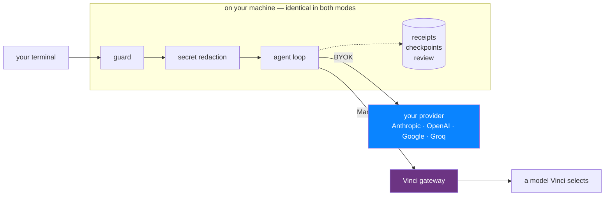

<div align="center">

<picture>
  <source media="(prefers-color-scheme: dark)" srcset="vinci/assets/logomark-inverse.svg" />
  
</picture>

# Vinci Code

A coding agent you can run with **your own provider key** — or with Vinci's managed service.<br/>Same guard rails either way.

[](https://nodejs.org)
[](LICENSE)
[](https://github.com/badlogic/pi-mono)
[](vinci/PRIVACY.md)

</div>

**Vinci Code is a distribution of [Pi](https://pi.dev)** — a thin fork of the
[Pi agent harness](https://github.com/badlogic/pi-mono) (MIT) by
[Mario Zechner](https://github.com/badlogic), maintained under
[SimpleDirect®](https://www.getsimpledirect.com) by Alpine Pacific Trading Inc. Pi's engine
and packages are kept intact; Vinci adds an additive layer on top. Provenance, including the
exact upstream commit this forked from, is in [`UPSTREAM.md`](UPSTREAM.md).

<div align="center">


</div>

## How it fits together



In **BYOK** the right-hand Vinci path does not exist — your key and your prompts go straight
to your provider, and Vinci's servers are not involved. Everything in the grey box runs
locally and is the same either way.

## Two ways to run it

| | **Direct / BYOK** | **Managed** |
|---|---|---|
| Vinci account | **not required** | required |
| Provider | you choose | Vinci selects |
| Your API key | stored locally; sent **only to your provider**, never to Vinci | you have none |
| Vinci sees your prompts | **no** | yes, in transit |
| Guard · receipts · checkpoints · review | ✅ | ✅ |

## Installation

```sh
# From source — the path this repository supports (Node 22.19+)
git clone https://github.com/getsimpledirect/vinci-code-cli
cd vinci-code-cli
npm install && bash vinci/build.sh
./vinci/bin/vinci
```

```sh
# Or the signed release (installs the built binary and self-updates)
curl -fsSL https://vinci.getsimpledirect.com/install | sh
```

> There is no `vinci` npm package. The npm packages in this repo are **upstream Pi's**
> (`@earendil-works/*`, binary `pi`) — installing those gives you Pi, not Vinci Code.

## Quick start — bring your own key

Nothing to configure. Install it, run it, pick a provider:

```sh
./vinci/bin/vinci

/login      # pick Anthropic, OpenAI, Google, Groq, … or Vinci
/model      # pick a model — foreign ones show their exact id and a provider badge
```

**No account, no environment variable, no sign-up.** Vinci's own classes are offered first, so
signing in to Vinci stays one keystroke away if you want managed inference — but nothing makes
you. Credentials are stored by Pi in `~/.pi/agent/auth.json`. Vinci Code adds no second credential
store, and your key is sent **only to the provider you picked** — authenticating to them requires
it — and never to Vinci.

Want the lean, Vinci-only view back? `VINCI_SHOW_OTHER_PROVIDERS=0`, or `showOtherProviders:
false` in settings.

## What the Vinci layer adds

| Capability | Status | What it does |
|---|:---:|---|
| Command guard | Shipped | Classifies destructive operations and confirms before running them |
| Secret redaction | Shipped | Masks credentials before the terminal, diffs, previews, and `/feedback` + `/issue` egress |
| Honest terminal states | Shipped | A run blocked awaiting permission says so, instead of reporting a read-only success |
| Checkpoints | Shipped | Durable recovery points you can roll back to |
| Review / accept | Shipped | A workflow for inspecting and accepting agent output |
| Sandbox | Shipped | Bounded execution for agent-run commands |
| BYOK | Shipped | Any Pi-supported provider, with every guard above still active |

Layout, the branch model, and the patch inventory: [`vinci/README.md`](vinci/README.md).

## Documentation

| Document | What it covers |
|---|---|
| [`vinci/README.md`](vinci/README.md) | The Vinci layer in detail — extensions, layout, branch model |
| [`vinci/PRIVACY.md`](vinci/PRIVACY.md) | Exactly what leaves your machine, in each mode |
| [`SECURITY.md`](SECURITY.md) | Reporting a vulnerability; known limits |
| [`UPSTREAM.md`](UPSTREAM.md) | Fork provenance and how to sync with Pi |
| [`CONTRIBUTING.md`](CONTRIBUTING.md) | How to contribute |

## Project status

**Actively maintained** by a small team. Security fixes go to the latest release only — there
is no LTS branch. APIs and settings may change before 1.0. Issues and pull requests are
welcome.

Security reports: [`SECURITY.md`](SECURITY.md). Report the *format* of a missed
credential, never a live key.

## License

**MIT**, throughout — see [`LICENSE`](LICENSE).

- Upstream Pi is © 2025 Mario Zechner, MIT. That notice is preserved verbatim.
- Vinci's modifications are © 2026 Alpine Pacific Trading Inc., under the same MIT grant.
- Third-party notices: [`THIRD_PARTY_NOTICES.md`](THIRD_PARTY_NOTICES.md).
- "Vinci" and "SimpleDirect" are trademarks of Alpine Pacific Trading Inc.; the code grant
  conveys **no** trademark rights. See [`TRADEMARKS.md`](TRADEMARKS.md) — if you fork and
  ship this, rename it.

There is no separately-licensed or source-available tier in this repository. Everything here
is MIT.

---

## Upstream project

The sections above this line describe Vinci Code. What follows is upstream Pi's own
documentation, retained so this fork stays honest about what it is built on. Its
badges, Discord and npm links point at **upstream Pi**, not at Vinci support.

# Pi Agent Harness

This is the home of the Pi agent harness project including our self extensible coding agent.

* **[@earendil-works/pi-coding-agent](packages/coding-agent)**: Interactive coding agent CLI
* **[@earendil-works/pi-agent-core](packages/agent)**: Agent runtime with tool calling and state management
* **[@earendil-works/pi-ai](packages/ai)**: Unified multi-provider LLM API (OpenAI, Anthropic, Google, …)

To learn more about Pi:

* [Visit pi.dev](https://pi.dev), the project website with demos
* [Read the documentation](https://pi.dev/docs/latest), but you can also ask the agent to explain itself

## All Packages

| Package | Description |
|---------|-------------|
| **[@earendil-works/pi-ai](packages/ai)** | Unified multi-provider LLM API (OpenAI, Anthropic, Google, etc.) |
| **[@earendil-works/pi-agent-core](packages/agent)** | Agent runtime with tool calling and state management |
| **[@earendil-works/pi-coding-agent](packages/coding-agent)** | Interactive coding agent CLI |
| **[@earendil-works/pi-tui](packages/tui)** | Terminal UI library with differential rendering |

For Slack/chat automation and workflows see [earendil-works/pi-chat](https://github.com/earendil-works/pi-chat).

## Permissions & Containerization

Pi does not include a built-in permission system for restricting filesystem, process, network, or credential access. By default, it runs with the permissions of the user and process that launched it.

If you need stronger boundaries, containerize or sandbox Pi. See [packages/coding-agent/docs/containerization.md](packages/coding-agent/docs/containerization.md) for three patterns:

- **Gondolin extension**: keep `pi` and provider auth on the host while routing built-in tools and `!` commands into a local Linux micro-VM.
- **Plain Docker**: run the whole `pi` process in a local container for simple isolation.
- **OpenShell**: run the whole `pi` process in a policy-controlled sandbox.

## Contributing

See [CONTRIBUTING.md](CONTRIBUTING.md) for contribution guidelines and [AGENTS.md](AGENTS.md) for project-specific rules (for both humans and agents).  Longer term plans for Pi can also be found in [RFCs](https://rfc.earendil.com/keyword/pi/).

## Development

```bash
npm install --ignore-scripts  # Install all dependencies without running lifecycle scripts
npm run build        # Build all packages
npm run check        # Lint, format, and type check
./test.sh            # Run tests (skips LLM-dependent tests without API keys)
./pi-test.sh         # Run pi from sources (can be run from any directory)
```

## Supply-chain hardening

We treat npm dependency changes as reviewed code changes.

- Direct external dependencies are pinned to exact versions. Internal workspace packages remain version-ranged.
- `.npmrc` sets `save-exact=true` and `min-release-age=2` to avoid same-day dependency releases during npm resolution.
- `package-lock.json` is the dependency ground truth. Pre-commit blocks accidental lockfile commits unless `PI_ALLOW_LOCKFILE_CHANGE=1` is set.
- `npm run check` verifies pinned direct deps, native TypeScript import compatibility, and the generated coding-agent shrinkwrap.
- The published CLI package includes `packages/coding-agent/npm-shrinkwrap.json`, generated from the root lockfile, to pin transitive deps for npm users.
- Release smoke tests use `npm run release:local` to build, pack, and create isolated npm and Bun installs outside the repo before tagging a release.
- Local release installs, documented npm installs, and `pi update --self` use `--ignore-scripts` where supported.
- CI installs with `npm ci --ignore-scripts`, and a scheduled GitHub workflow runs `npm audit --omit=dev` plus `npm audit signatures --omit=dev`.
- Shrinkwrap generation has an explicit allowlist for dependency lifecycle scripts; new lifecycle-script deps fail checks until reviewed.

## Share your OSS coding agent sessions

If you use Pi or other coding agents for open source work, please share your sessions.

Public OSS session data helps improve coding agents with real-world tasks, tool use, failures, and fixes instead of toy benchmarks.

For the full explanation, see [this post on X](https://x.com/badlogicgames/status/2037811643774652911).

To publish sessions, use [`badlogic/pi-share-hf`](https://github.com/badlogic/pi-share-hf). Read its README.md for setup instructions. All you need is a Hugging Face account, the Hugging Face CLI, and `pi-share-hf`.

You can also watch [this video](https://x.com/badlogicgames/status/2041151967695634619), where I show how I publish my `pi-mono` sessions.

I regularly publish my own `pi-mono` work sessions here:

- [badlogicgames/pi-mono on Hugging Face](https://huggingface.co/datasets/badlogicgames/pi-mono)

<p align="center">
  <a href="https://pi.dev">pi.dev</a> domain graciously donated by
  <br /><br />
  <a href="https://exe.dev"><br />exe.dev</a>
</p>
